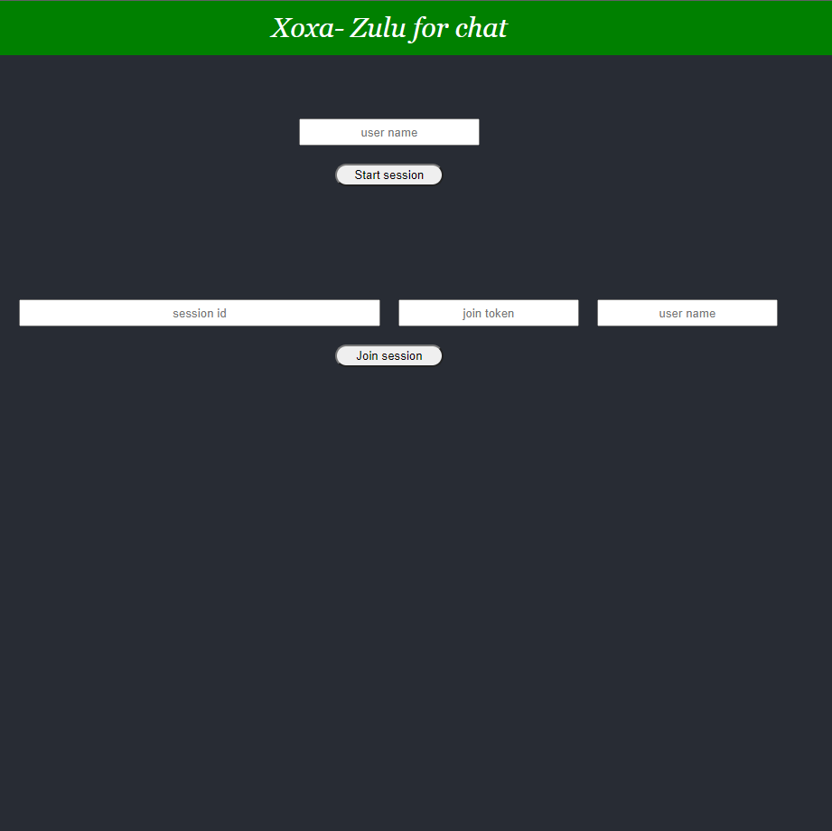
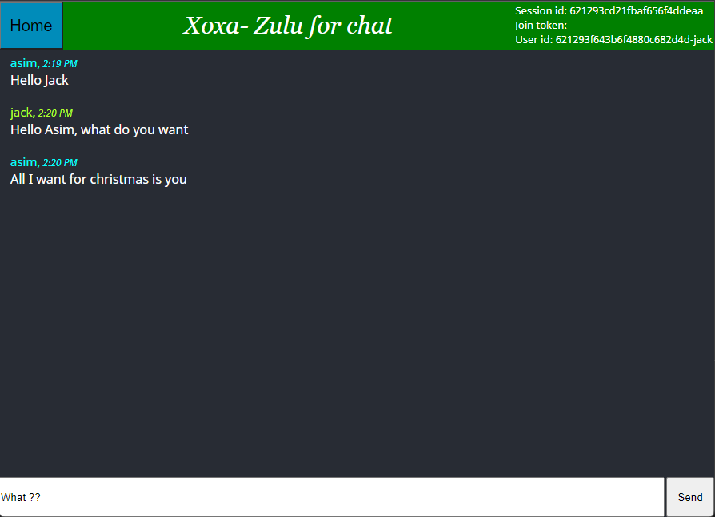

# Xoxa - Zulu for chat

This is a simple websocket based chat app. The goal was to build a simple chat app and learn about websocket along the way.

# Screenshots
### Home page

### Chat page 1

### Chat page 2

# Tech Used
- Spring boot
- MongoDB
- React JS
- WebSocket
- STOMP messaging protocol
- Memory based message broker

# Steps to run the app

### Run `./mvnw spring-boot:run`
Starts the application

### Run the xoxa-client

### Run without xoxa-client (not functional)
localhost:8080 also serves up a page from src/main/resources/static/app.js which can be used to just check the app.

## ISSUES 

- Messages are not being saved to database when being sent from the React UI. But if the messages are sent from src/main/resources/static/app.js, the messages are saved.
